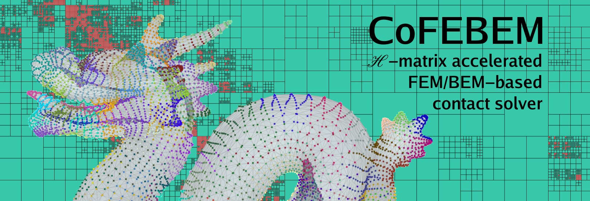

<!-- # CoFEBEM Project -->

---

## Description

CoFEBEM project aims at constructing a powerful and universal contact solver based on FEM/BEM and accelerated by $\mathcal H$-matrix algebra

## Features

+ Fast contact algorithms
    + unilateral contact: analytical-surface against deformable solid
    + bilateral contact: deformable-to-deformable contact
+ C++ code with a Python wrapper
+ FEA-code agnostic
    + available interface FEniCSx
    + future interfaces MFEM, A-set

